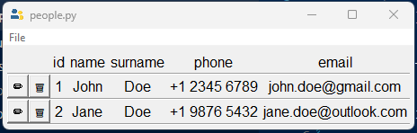
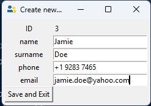
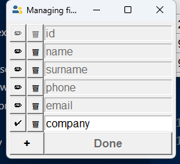
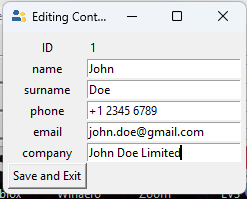
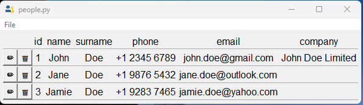
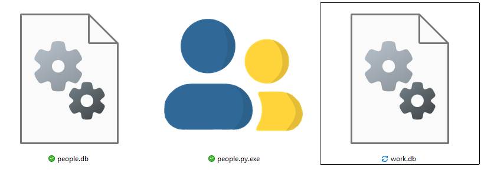
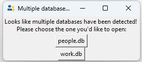

# 

A contact manager designed to fit your own needs.

Built using python, tkinter and sqlite3. 

Inspired by [PokeMatPok/contact](https://github.com/PokeMatPok/contact).

# Features:
## Creating, editing and deleting contacts
Well, this one's obvious. You can create contacts, view them, edit them, and delete them.




## Creating, editing and deleting **fields**
Yup! **people.py** is designed to tailor to you, and you only. Say you'd like to save where John works:



Boom.



Bam.



And that's it!

## Click-to-copy

This one's a simple one. Just click any text on the main screen, and see it on your clipboard!

_Curtesy of [pyperclip](https://pypi.org/project/pyperclip/)_
## Working with multiple databases
people.py saves your contacts in a file called "people.db". But what if I want to separate between, say, my coworkers, clients and friends? Easy! Just create a new file named "(your database name here).db" at the same place your executable is, and boom! _(Please replace '(your database name here)' with your desired name)_

Your folder should look something like this:



If it does, you'll see this pop up:



And choose which database you'd like to work on!

> [!WARNING] 
> Do **NOT** delete any of the .db files. These files contain your contacts. If you delete them, your contacts will be lost!

# Downloads

To download this program, go to [the releases page](https://github.com/Aquaticsanti/people.py/releases/latest) and download the file "people.py.exe".

This program is only available for Windows. I don't have the tools necesary to compile for Linux or MacOS, and I'm not planning for it.

# Building

To build this, use [PyInstaller](https://pyinstaller.org/)!

First, clone the repo
```` 
git clone https://github.com/Aquaticsanti/people.py.git
````
Then, _cd_ into the repo, and delete __dist/__ and __people.py.spec__.

Lastly, run:
````
pyinstaller --clean -y -n "people.py" --add-data="people.py/logo.png;files" -F -i people.py/logo.png -w people.py/__main__.py
````
And done! You should find _people.py.exe_ on your dist folder!

# Thanks for using people.py!
